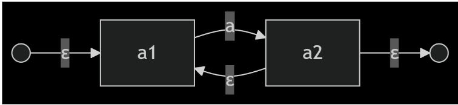
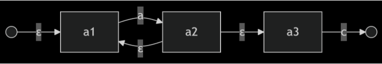
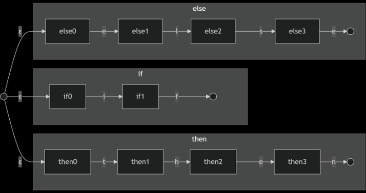

## a) Expressão regular `(if | then | else)`

### Passo a passo

#### Tokens individuais
- `if`, `then` e `else` são **strings literais**.
- Cada palavra-chave é convertida em um **NFA linear**, no qual cada caractere corresponde a uma transição entre estados.

#### Operador de alternância (`|`)
- Os NFAs correspondentes a `if`, `then` e `else` são conectados por meio de **transições ε (epsilon)** a partir de um único estado inicial.
- Cada sub-NFA possui seu próprio estado final.

### NFA para a expressão `(if | then | else)`

---

### Estrutura do NFA

- **Explicação:**  
  Um único estado inicial com transições ε para os estados iniciais dos NFAs de `if`, `then` e `else`.

- **Estados Iniciais:**
  Cada sub-NFA (if, then, else) tem seu próprio estado final.

- **Transições:**
   Seguem os caracteres das palavras-chave.
  
- **Estados finais:**  
  Os estados finais de cada sub-NFA são estados de aceitação.
  Cada sub-NFA (if, then, else) tem seu próprio estado final.
  

### DFA obtido pelo algoritmo de subconjuntos

## b) Expressão regular `a((b | a* c)x)* | x* a`

A construção do NFA é feita de forma incremental, decompondo a expressão regular em subexpressões menores, conforme o método de Thompson.

---

### 1. Subexpressão `a*`

O operador `*` indica **zero ou mais ocorrências** do símbolo `a`.  
O NFA correspondente possui:
- uma transição ε que permite aceitar a string vazia;
- um ciclo rotulado com `a`.

#### NFA para `a*`

---

### 2. Subexpressão `a* c`

A subexpressão `a* c` é obtida por **concatenação**:
- o estado final do NFA de `a*` é conectado ao estado inicial do símbolo `c`
  por meio de uma transição ε.

#### NFA para `a* c`

---

### 3. Subexpressão `(b | a* c)`

Essa subexpressão é construída por **alternância** entre:
- um NFA simples para o símbolo `b`;
- o NFA correspondente à subexpressão `a* c`.

Um novo estado inicial é criado, com **transições ε** para os estados iniciais
de ambos os NFAs.

#### NFA para `(b | a* c)`

---

### Observação

A partir dessa subexpressão, o NFA completo da expressão  
`a((b | a* c)x)* | x* a` pode ser obtido aplicando sucessivamente:
- concatenação com o símbolo `x`;
- fechamento de Kleene (`*`);
- alternância final com `x* a`.
