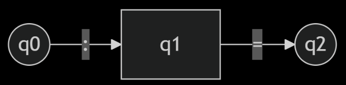
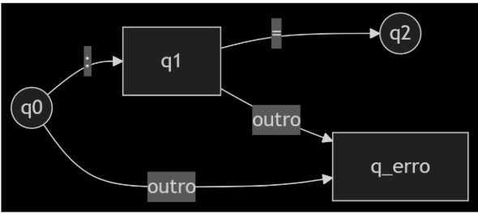
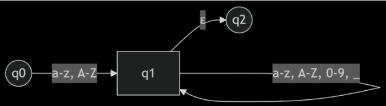
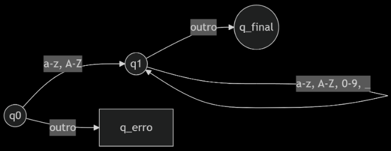
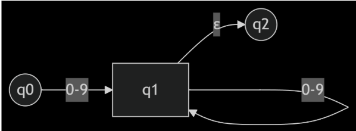
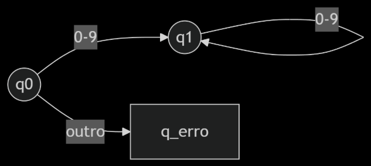
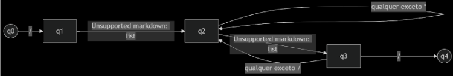

## Questão 8 — Análise Léxica

Crie tokens apropriados e realize a análise léxica dos seguintes códigos.

---

### a) Pascal

#### Código-fonte

```pascal
function max (i, j : integer ) : integer ;
{ retorna maior dos inteiros entre i e j }
begin
    if i > j then max := i
    else max := j
end;
```

## Tabela de Tokens

| Lexema    | Token     | Categoria                  |
|-----------|-----------|----------------------------|
| function  | FUNCTION  | Palavra-chave              |
| max       | ID        | Identificador (função)     |
| (         | LPAREN    | Delimitador                |
| i         | ID        | Identificador (parâmetro)  |
| ,         | COMMA     | Delimitador                |
| j         | ID        | Identificador (parâmetro)  |
| :         | COLON     | Delimitador                |
| integer   | INTEGER   | Palavra-chave              |
| )         | RPAREN    | Delimitador                |
| ;         | SEMICOLON | Delimitador                |
| begin     | BEGIN     | Palavra-chave              |
| if        | IF        | Palavra-chave              |
| >         | GT        | Operador relacional        |
| then      | THEN      | Palavra-chave              |
| :=        | ASSIGN    | Operador de atribuição     |
| else      | ELSE      | Palavra-chave              |
| end       | END       | Palavra-chave              |
| { … }     | COMMENT   | Comentário                 |

> **Observação:** Comentários são ignorados pelo analisador léxico (Seção 3.1.5 — comentários não geram tokens).


## Expressões Regulares

| Token       | Expressão Regular             | Exemplo           |
|-------------|-------------------------------|-------------------|
| FUNCTION    | `function`                    | `function max`    |
| BEGIN       | `begin`                       | `begin`           |
| END         | `end`                         | `end`             |
| IF          | `if`                          | `if i > j`        |
| THEN        | `then`                        | `then max := i`   |
| ELSE        | `else`                        | `else max := j`   |
| INTEGER     | `integer`                     | `i : integer`     |
| ID          | `[a-zA-Z][a-zA-Z0-9_]*`       | `max, i, j`       |
| NUM         | `[0-9]+`                      | `10`              |
| LPAREN      | `\(`                          | `(i, j)`          |
| RPAREN      | `\)`                          | `)`               |
| COMMA       | `,`                           | `,`               |
| COLON       | `:`                           | `:`               |
| SEMICOLON   | `;`                           | `;`               |
| ASSIGN      | `:=`                          | `max := i`        |
| GT          | `>`                           | `i > j`           |
| COMMENT     | `\{[^\}]*\}`                  |                   |

## Prioridade e Ambiguidade

### Maior casamento possível (guloso)
O analisador léxico sempre escolhe o lexema mais longo que corresponda a uma expressão regular.

**Exemplos:**
- `if8` é reconhecido como um identificador (não `if` + `8`)
- `:=` é reconhecido como um único token (não `:` + `=`)

### Prioridade de tokens
Se duas expressões regulares casarem o mesmo lexema, a primeira definida na especificação tem prioridade.

---


## Autômatos

### a) Operador de atribuição (`:=`)

#### NFA (Autômato Finito Não-determinístico)


#### DFA (Autômato Finito Determinístico)


### b) Identificador (`[a-zA-Z][a-zA-Z0-9_]*`)

#### NFA (Autômato Finito Não-determinístico)


#### DFA (Autômato Finito Determinístico)


---


### b) C

#### Código-fonte

```c
int max (i, j) int i, j;
/* retorna o maior dos inteiros entre
i e j  */
{
    return i>j?    i  :  j;
}

```

## Tabela de Tokens

| Token     | Lexema       | Categoria                    |
|-----------|--------------|------------------------------|
| `int`     | `int`        | Palavra-chave (tipo)         |
| `max`     | `max`        | Identificador (função)       |
| `(`       | `lparen`     | Delimitador                  |
| `i`, `j`  | `id`         | Identificador (parâmetro)    |
| `)`       | `rparen`     | Delimitador                  |
| `,`       | `comma`      | Delimitador                  |
| `;`       | `semicolon`  | Delimitador                  |
| `{`       | `lbrace`     | Delimitador                  |
| `return`  | `return`     | Palavra-chave                |
| `i>j? i : j` | `cond_expr` | Expressão condicional        |
| `>`       | `gt`         | Operador relacional          |
| `?`       | `question`   | Operador condicional         |
| `:`       | `colon`      | Operador condicional         |
| `}`       | `rbrace`     | Delimitador                  |
| `/* … */` | -            | Comentário                   |

> **Observação:** Comentários são ignorados pelo analisador léxico e não geram tokens.

## Expressões Regulares

| Token       | Expressão Regular                     | Exemplo                  |
|-------------|---------------------------------------|--------------------------|
| INT         | `int`                                 | `int max`                |
| return      | `return`                              | `return i>j? i : j`      |
| id          | `[a-zA-Z_][a-zA-Z0-9_]*`              | `max, i, j`              |
| num         | `[0-9]+`                              | `42`                     |
| lparen      | `\(`                                  | `(`                      |
| rparen      | `\)`                                  | `)`                      |
| comma       | `,`                                   | `i, j`                   |
| semicolon   | `;`                                   | `;`                      |
| lbrace      | `\{`                                  | `{`                      |
| rbrace      | `\}`                                  | `}`                      |
| gt          | `>`                                   | `i>j`                    |
| question    | `\?`                                  | `i>j?`                   |
| colon       | `:`                                   | `:`                      |
| comment     | `\/\*[^*]*\*+([^/*][^*]*\*+)*\/`      | `/* retorna o maior */`  |

## Autômatos

### a) Número Inteiro (`[0-9]+`)

#### NFA (Autômato Finito Não-determinístico)


#### DFA (Autômato Finito Determinístico)


---

### b) Comentário (`\/\*.*?\*\/`)

#### NFA (Autômato Finito Não-determinístico)


#### DFA (Autômato Finito Determinístico) (simplificado)


---

### Nota sobre Transições "outro"

Em autômatos finitos (NFAs e DFAs), a transição rotulada como **"outro"** (ou "qualquer outro símbolo não especificado") é uma transição genérica que captura todos os caracteres que não estão definidos explicitamente nas arestas do autômato.

Quando um autômato encontra um símbolo que não corresponde a nenhuma transição válida, ele segue para um estado de erro (`q_erro`), indicando que o lexema atual é inválido.
