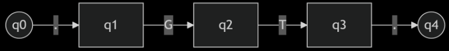
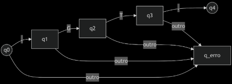
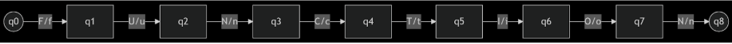
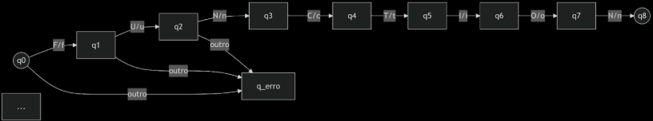

### c) Fortran 77

#### Código-fonte

```fortran
FUNCTION MAX (I, J)
C RETORNA O MAIOR DOS INTEIROS ENTRE I E J
	
	IF (I  .GT.  J)  THEN
		MAX = I
	ELSE
		MAX = J
	END IF
RETURN
```

## Tabela de Tokens

| Token     | Lexema  | Categoria                    |
|-----------|---------|------------------------------|
| FUNCTION  | FUNCTION | Palavra-chave               |
| MAX       | ID      | Identificador (função)      |
| (         | LPAREN  | Delimitador                 |
| I, J      | ID      | Identificador (parâmetro)   |
| )         | RPAREN  | Delimitador                 |
| IF        | IF      | Palavra-chave               |
| .GT.      | GT      | Operador relacional         |
| THEN      | THEN    | Palavra-chave               |
| =         | ASSIGN  | Operador de atribuição      |
| I         | ID      | Identificador (valor)       |
| ELSE      | ELSE    | Palavra-chave               |
| END IF    | ENDIF   | Palavra-chave               |
| RETURN    | RETURN  | Palavra-chave               |
| C …       | -       | Comentário                  |

> **Observação:** Em Fortran 77, linhas que começam com `C` na primeira coluna são comentários e são ignorados pelo analisador léxico.

## Expressões Regulares

| Token     | Expressão Regular                                   | Exemplo                  |
|-----------|-----------------------------------------------------|--------------------------|
| FUNCTION  | `[Ff][Uu][Nn][Cc][Tt][Ii][Oo][Nn]`                 | `FUNCTION MAX`           |
| IF        | `[Ii][Ff]`                                         | `IF`                     |
| THEN      | `[Tt][Hh][Ee][Nn]`                                 | `THEN`                   |
| ELSE      | `[Ee][Ll][Ss][Ee]`                                 | `ELSE`                   |
| ENDIF     | `[Ee][Nn][Dd]\s*[Ii][Ff]`                          | `END IF`                 |
| RETURN    | `[Rr][Ee][Tt][Uu][Rr][Nn]`                         | `RETURN`                 |
| ID        | `[A-Za-z][A-Za-z0-9_]*`                            | `MAX, I, J`              |
| NUM       | `[0-9]+`                                           | `42`                     |
| LPAREN    | `\(`                                               | `(`                      |
| RPAREN    | `\)`                                               | `)`                      |
| COMMA     | `,`                                                | `I, J`                   |
| ASSIGN    | `=`                                                | `MAX = I`                |
| GT        | `\.gt\.`                                           | `.GT.`                   |
| COMMENT   | `^[Cc].*`                                          | `C RETORNA O MAIOR...`   |

## Autômatos

### a) Operador Relacional (`.GT.`)

#### NFA (Autômato Finito Não-determinístico)


#### DFA (Autômato Finito Determinístico)


---

### b) Palavra-Chave (`FUNCTION` case-insensitive)

#### NFA (Autômato Finito Não-determinístico)


#### DFA (Autômato Finito Determinístico) (simplificado)


---

## Observações

### Análise Léxica Geral
- Em todas as linguagens, os tokens são identificados conforme a gramática da linguagem-fonte.
- A análise léxica ignora comentários, mas eles são reconhecidos como tokens especiais ou descartados.
- Os símbolos especiais (parênteses, vírgulas, dois-pontos, etc.) são tokens que ajudam a estruturar a linguagem.
- Palavras-chave são reservadas e não podem ser usadas como identificadores.
- O operador ternário (`? :`) é exclusivo de linguagens como C.

### Diferença entre Token e Lexema
- **Token**: É uma categoria geral (como "identificador", "número", "palavra-chave").
- **Lexema**: É o conteúdo específico da entrada que pertence àquela categoria.

Um token pode ter muitos lexemas associados.

**Exemplo:**
- **Token**: `IDENTIFICADOR`
- **Lexemas válidos**: `soma`, `valor1`, `temp`, `i`, etc.

### Prioridade de Tokens
- O analisador léxico segue a regra do **maior casamento possível** (Seção 3.1.5).
  - Exemplo: `:=` é reconhecido como um único token (`ASSIGN`), e não como `:` seguido de `=`.
- Palavras-chave têm prioridade sobre identificadores.
  - Exemplo: `if` é token `IF`, não `ID`.

### Elementos Ignorados
- Comentários e espaços em branco são descartados durante a análise léxica.
